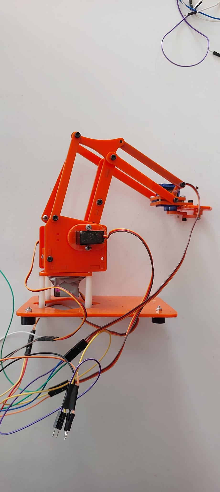
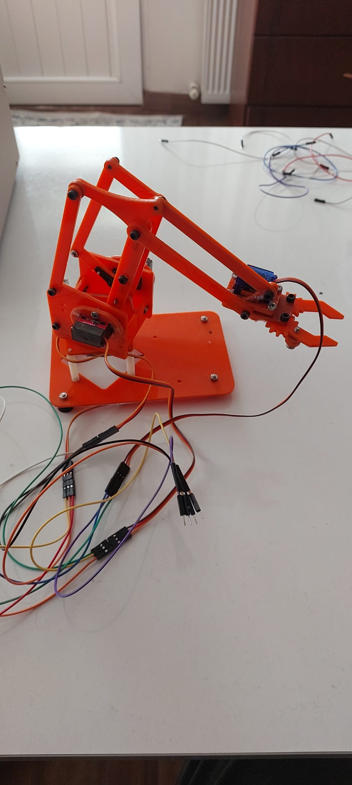
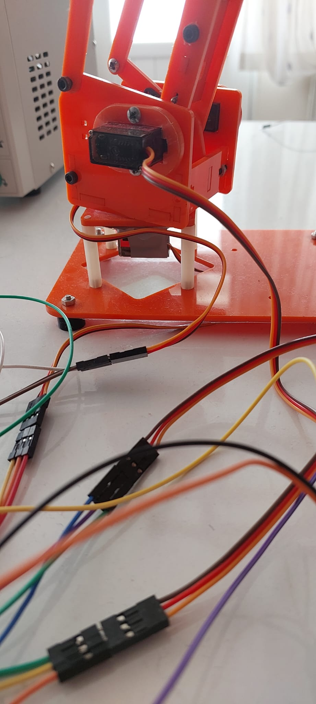
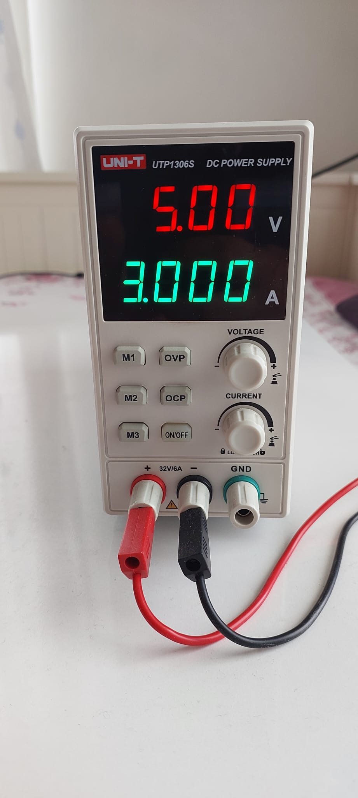
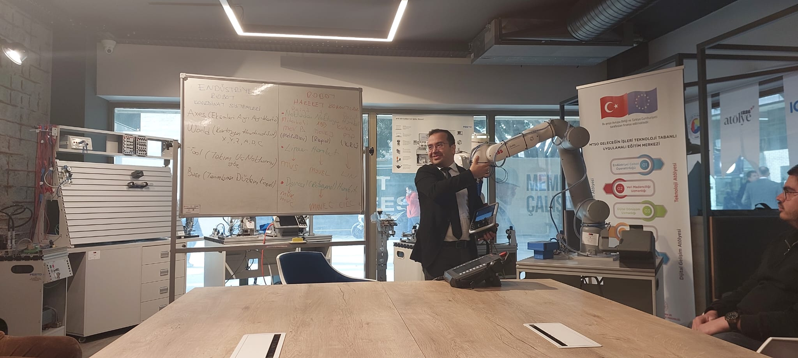
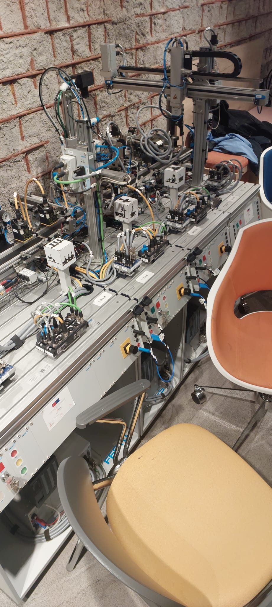

# 🤖 ScrapArm v1 — Arduino Robotic Arm

> **A hands-on 4-DOF robotic arm prototype built to learn motion control, servo actuation, power distribution, mechanical integration, and the foundations behind industrial robotics.**

ScrapArm v1 is my first complete robotic-arm build: a compact, Arduino-controlled prototype with **base rotation, shoulder movement, elbow movement, and a gripper**. I built and integrated the system from the ground up as a practical way to move beyond software-only projects and work directly with electromechanical hardware.

The project became more than a small servo arm. While developing it, I also attended robotics and industrial-automation training sessions covering industrial robots, collaborative robots (cobots), coordinate systems, motion concepts, automation hardware, and production-cell thinking. Those experiences changed how I looked at this prototype: not as a finished industrial robot, but as a small platform for learning the same categories of problems that appear in larger robotic systems.

---

## 📸 Prototype

<p align="center">
  
  
</p>

### 🔍 Close-up

<p align="center">
  
</p>

---

## 🚀 Project at a Glance

| Category | Implementation | Status |
|---|---|---|
| **Robot Type** | Desktop articulated robotic arm | ✅ Built |
| **Degrees of Freedom** | 4-DOF | ✅ Functional |
| **Axes / Functions** | Base · Shoulder · Elbow · Gripper | ✅ Implemented |
| **Controller** | Arduino-based control | ✅ Integrated |
| **Actuation** | Hobby servo motors | ✅ Integrated |
| **Power** | External regulated 5 V supply | ✅ Tested |
| **Mechanical System** | Multi-link arm with servo-driven joints | ✅ Assembled |
| **End Effector** | Servo-driven gripper | ✅ Integrated |
| **Development Goal** | Learn robotics through a physical system | ✅ Achieved |
| **Next Revision** | Cleaner electronics, smoother coordinated motion, stronger control architecture | 🔧 Planned |

---

## 🧭 Quick Navigation

- [System Overview](#system-overview)
- [Degrees of Freedom](#degrees-of-freedom)
- [Control Architecture](#control-architecture)
- [Power System](#power-system)
- [Mechanical Integration](#mechanical-integration)
- [Build & Testing Process](#build--testing-process)
- [Engineering Challenges](#engineering-challenges)
- [Industrial Robotics & Automation Training](#industrial-robotics--automation-training)
- [What This Project Taught Me](#what-this-project-taught-me)
- [Future Development](#future-development)
- [Repository Structure](#repository-structure)

---

<a id="system-overview"></a>
# 🧠 System Overview

ScrapArm is intentionally simple enough to understand end-to-end.

At a high level:

```text
          ┌──────────────────────┐
          │      Arduino         │
          │   Control Signals    │
          └──────────┬───────────┘
                     │
         ┌───────────┼───────────┬──────────────┐
         │           │           │              │
         ▼           ▼           ▼              ▼
    Base Servo   Shoulder     Elbow Servo   Gripper Servo
                    Servo
         │           │           │              │
         └───────────┴─────┬─────┴──────────────┘
                           │
                           ▼
                  Mechanical Arm Motion

          External Regulated 5 V Supply
                     │
                     ▼
               Servo Power Rail
```

The controller determines the desired servo positions, while the external power source supplies the current required by the actuators.

One of the most important design lessons was understanding that **control power and actuator power are different problems**. An Arduino can generate servo control signals, but several motors moving under load require a more appropriate external power source than the microcontroller's onboard regulator.

---

<a id="degrees-of-freedom"></a>
# 🦾 Degrees of Freedom

The arm uses four controlled functions:

| Axis | Function | What It Changes |
|---|---|---|
| **Base** | Rotation | Turns the arm left/right around the vertical axis |
| **Shoulder** | Main lift | Raises or lowers the primary arm structure |
| **Elbow** | Reach / articulation | Changes the extension and working position of the arm |
| **Gripper** | End-effector actuation | Opens and closes the gripping mechanism |

This gives the prototype enough movement to explore basic positioning and pick/place-style motion concepts without hiding the mechanics behind a commercial robot controller.

### Why 4-DOF?

A 4-DOF arm is a useful learning platform because it introduces several real robotics problems at once:

- multiple joints influence the final tool position;
- servo limits have to be respected;
- mechanical geometry affects reachable space;
- movements that are valid for one joint may cause interference when several joints move together;
- the gripper has to be treated as part of the overall motion sequence rather than as an unrelated motor.

The prototype does **not** claim industrial precision or six-axis pose control. Its value is that the complete chain from software command to physical movement is visible and understandable.

---

<a id="control-architecture"></a>
# 🎛️ Control Architecture

The control side of ScrapArm is based around an Arduino generating servo-position commands.

For a hobby servo, the important concept is not simply "turn motor on." The controller repeatedly sends a timed control signal corresponding to a requested angular position. The servo's internal electronics then close the local position loop.

Conceptually:

```text
Target Joint Position
        │
        ▼
Arduino Servo Command
        │
        ▼
PWM-Style Control Signal
        │
        ▼
Servo Internal Controller
        │
        ▼
Mechanical Joint Position
```

This makes hobby servos convenient for a first robotic arm because the low-level motor driver and local feedback loop are already contained inside the actuator.

At the same time, using several servos exposes higher-level robotics problems:

- joint coordination;
- movement sequencing;
- speed differences between joints;
- mechanical range limits;
- power transients;
- repeatability;
- avoiding sudden jumps at startup;
- keeping the wiring from restricting motion.

### Motion philosophy in v1

The first version focuses on **direct joint control** rather than pretending to implement a full industrial robot stack.

The arm can therefore be thought of in joint space:

```text
q = [base, shoulder, elbow, gripper]
```

where each value represents a commanded servo position.

A future version could build on this by introducing:

- named poses;
- interpolation between poses;
- motion profiles;
- Cartesian target positions;
- inverse kinematics;
- trajectory planning.

---

<a id="power-system"></a>
# ⚡ Power System

Servo power was treated as a separate engineering concern rather than powering the complete arm from the Arduino board.

During bench testing, I used a regulated DC supply configured to **5.00 V** with a **3.00 A current limit**.

<p align="center">
  
</p>

> The 3.00 A value shown on the supply is the configured current limit, not a claim that the arm continuously consumes 3 A.

### Why an external supply?

Servo motors can produce short current spikes, especially:

- during startup;
- when changing direction;
- when several joints move at the same time;
- when a joint is mechanically loaded;
- when the gripper pushes against an object or its mechanical stop.

Supplying the servos through an external regulated rail helps avoid placing that actuator load on the microcontroller's onboard regulator.

### Common reference

Even when control and actuator power are separated, the control signal still needs a valid electrical reference. The controller ground and servo-power ground therefore need a common reference for reliable signal interpretation.

Conceptually:

```text
                +---------------- Arduino signal
                |
Arduino GND ----+---------------- Servo GND
                                 |
5 V Supply GND -----------------+
```

This project gave me practical experience with a lesson that matters far beyond hobby robotics:

> **A correct control algorithm can still fail if the electrical architecture is wrong.**

---

<a id="mechanical-integration"></a>
# ⚙️ Mechanical Integration

The arm is a linked mechanical system, so every actuator affects more than a single electrical signal.

The build required integrating:

- servo mounting;
- rotating joints;
- mechanical linkages;
- fasteners;
- the base structure;
- arm geometry;
- the gripper;
- wiring that moves with the mechanism.

<p align="center">
  
</p>

## Linkage behavior

The shoulder and elbow structure uses connected links to transfer servo motion through the arm.

This means the practical behavior is influenced by:

- joint geometry;
- lever arm length;
- servo torque;
- mechanical friction;
- component flex;
- fastener tightness;
- the mass being moved;
- the location of the center of gravity.

That distinction became important: software may request a position instantly, but the real mechanism has inertia, backlash, load, and physical limits.

---

<a id="build--testing-process"></a>
# 🧪 Build & Testing Process

The system was developed incrementally rather than connecting every component and hoping the full arm worked.

## 1. Mechanical assembly

The first step was assembling the arm structure and checking that each joint could move through a usable range without obvious binding.

## 2. Individual servo testing

Each actuator was treated as an independent subsystem before coordinated motion.

The goals were to verify:

- correct signal connection;
- correct power connection;
- movement direction;
- approximate safe range;
- whether the servo horn/linkage was mounted in a sensible neutral position.

## 3. External power testing

The servos were tested from a regulated external 5 V supply rather than depending on microcontroller power.

This reduced the chance that servo current spikes would destabilize the control electronics.

## 4. Joint-by-joint integration

The system was then treated as four motion functions:

```text
Base
  ↓
Shoulder
  ↓
Elbow
  ↓
Gripper
```

Each was validated before thinking about coordinated movement.

## 5. Full-arm integration

Once the joints responded individually, the real engineering problems became system-level:

- whether multiple servos could move reliably;
- whether wiring interfered with the mechanism;
- whether motion caused voltage/power issues;
- whether commanded positions were mechanically safe;
- whether the arm moved repeatably enough to be useful as a learning platform.

---

<a id="engineering-challenges"></a>
# 🛠️ Engineering Challenges

## 1. Powering multiple servos

One of the most important practical issues was actuator power.

A small microcontroller project may appear electrically simple until several motors move simultaneously. Using a dedicated external 5 V source made the power architecture more appropriate for a multi-servo system.

### Lesson

**Logic/control requirements and actuator-power requirements should be designed separately.**

---

## 2. Cable management vs. motion

The wiring has to reach every actuator while the arm itself is moving.

Too little slack can restrict a joint or pull on a connector. Too much loose wiring can interfere with the mechanism.

The prototype intentionally leaves this visible because cable routing is one of the clear areas for improvement in v2.

---

## 3. Mechanical zero positions

A servo can be electronically commanded to a reasonable value but still be mechanically installed at a poor angle.

That makes assembly alignment important.

The useful joint range depends on both:

```text
servo command range
+
physical horn/linkage installation
```

This is a good example of a robotics problem that cannot be solved by software alone.

---

## 4. Coordinating several joints

Moving one joint is straightforward. Moving several joints so that the overall arm behaves smoothly is a different problem.

Directly commanding several target angles can produce motion that is:

- abrupt;
- visually unsynchronized;
- mechanically stressful;
- difficult to reproduce as a clean path.

That is one of the main motivations for future interpolation and trajectory-control work.

---

## 5. Hobby hardware limitations

The arm is a prototype and learning platform, not an industrial manipulator.

Hobby servos and a lightweight mechanism naturally introduce limitations such as:

- backlash;
- limited torque;
- limited repeatability;
- no external joint encoder feedback exposed to the controller;
- simplified motion control;
- no industrial safety controller.

Understanding those limitations is useful because it makes the differences between hobby and industrial robotics concrete.

---

<a id="industrial-robotics--automation-training"></a>
# 🏭 Industrial Robotics & Automation Training

While developing my interest in robotics, I was invited to and attended practical training sessions around **industrial robots, collaborative robots (cobots), automation systems, and robotic work cells**.

These sessions gave me a much larger reference point for the ideas I was experimenting with on ScrapArm.

<p align="center">
  
  
</p>

<p align="center">
  
</p>

## Topics I was exposed to

The sessions connected hands-on robot operation with broader automation concepts, including areas such as:

### 🤖 Industrial robot fundamentals

- articulated robot axes;
- joint movement vs. tool movement;
- robot work envelopes;
- end effectors and grippers;
- positioning and repeatable motion;
- teach-pendant-based operation.

### 🌐 Coordinate systems

Industrial robot programming depends heavily on understanding which coordinate frame a motion is defined in.

Important frames include concepts such as:

- **joint / axis coordinates**;
- **world coordinates**;
- **base coordinates**;
- **tool coordinates**.

This gave me a better way to think about ScrapArm. My first prototype mainly commands joint positions directly. A more advanced system would define tool positions relative to useful coordinate frames and calculate the corresponding joint motion.

### 🛤️ Robot motion concepts

Industrial systems distinguish between different types of movement depending on the task.

Examples include concepts such as:

- point-to-point motion;
- linear motion;
- circular/path-based motion;
- speed and acceleration considerations;
- approach and retreat positions.

That is a major step beyond simply sending four servo angles to a hobby arm.

### 🤝 Collaborative robotics

Cobot systems introduced another dimension: robots operating in environments designed for closer human interaction.

That brings attention to:

- speed and force limitations;
- risk assessment;
- safe operating zones;
- emergency-stop behavior;
- task and cell design;
- the difference between a robot being "collaborative" and an entire application being safe.

### 🏭 Automation systems

The training environment also exposed me to larger automation systems containing combinations of:

- sensors;
- actuators;
- pneumatic equipment;
- conveyors / transfer mechanisms;
- control panels;
- industrial I/O;
- robotic cells;
- coordinated manufacturing processes.

Seeing those systems made it clear that a robot arm is only one component of an automation solution.

---

# 🔬 ScrapArm vs. an Industrial Robot

ScrapArm is intentionally small, but comparing it with industrial equipment is useful.

| Area | ScrapArm v1 | Industrial Robotic System |
|---|---|---|
| **Purpose** | Learning / prototyping | Production / automation |
| **Scale** | Desktop | Factory / cell level |
| **Control** | Arduino-level joint commands | Dedicated robot controller |
| **Actuators** | Hobby servos | Industrial servo drives/motors |
| **Feedback** | Internal hobby-servo positioning | High-resolution encoder feedback |
| **Programming** | Direct servo positioning | Robot language / teach pendant / offline programming |
| **Coordinates** | Primarily joint-space thinking | Joint, world, base, tool, work-object frames |
| **Trajectory Control** | Basic | Coordinated path planning and interpolation |
| **Safety** | Prototype-level precautions | Engineered safety systems and standards |
| **Integration** | Standalone learning platform | PLCs, sensors, tooling, conveyors, safety, networks |
| **Precision / Repeatability** | Limited | Designed and specified for repeatable production |
| **Power** | Regulated 5 V servo rail | Industrial electrical / drive systems |

The goal is not to make ScrapArm look like an industrial robot. The goal is to show the progression in my learning: **build a small system myself, understand its limitations, then connect those lessons to larger automation architecture.**

---

<a id="what-this-project-taught-me"></a>
# 🎓 What This Project Taught Me

## Robotics is multidisciplinary

The arm only works when several areas cooperate:

```text
Software
   +
Electronics
   +
Power
   +
Mechanics
   +
Control
   =
Working Robot
```

A problem that appears to be "bad code" may actually come from power delivery, joint alignment, mechanical interference, or wiring.

## Physical systems expose assumptions immediately

In software, an incorrect assumption may produce an error message.

In robotics, an incorrect assumption can produce:

- a stalled servo;
- an unexpected direction of motion;
- a cable being pulled;
- a joint hitting its limit;
- unstable power;
- a gripper applying force where it should not.

That made debugging much more concrete.

## Joint control is not the same as robot motion

Sending angles to four servos is only the beginning.

Useful robot motion eventually requires thinking about:

- where the end effector is;
- where it should go;
- how it should travel there;
- how fast each joint should move;
- whether the path is mechanically valid.

## Power architecture matters

The bench-supply work was one of the most practical lessons in the project. Actuators can dominate the electrical requirements of a robotic system even when the controller itself uses very little power.

## Industrial training changed the roadmap

After seeing industrial robots and automation cells, the most interesting future improvements became less about adding random features and more about adding **structure**:

- safer startup behavior;
- repeatable named poses;
- coordinated motion;
- coordinate-system thinking;
- clearer separation between control, power, and mechanics;
- eventually adding sensor feedback and a more formal control layer.

---

<a id="future-development"></a>
# 🚀 Future Development

ScrapArm v1 is intentionally a first revision.

## Near-term improvements

- [ ] Clean up cable routing
- [ ] Add proper connectors / distribution instead of temporary jumper wiring
- [ ] Document exact pin mapping
- [ ] Archive the Arduino firmware in this repository
- [ ] Define calibrated minimum/maximum angles for every joint
- [ ] Add a safe startup / home pose
- [ ] Add named poses
- [ ] Interpolate movements instead of jumping directly between positions
- [ ] Improve coordinated multi-joint motion

## Control improvements

- [ ] Create reusable joint-control abstractions
- [ ] Add configurable speed limits
- [ ] Implement smooth acceleration/deceleration
- [ ] Add basic trajectory generation
- [ ] Explore forward kinematics
- [ ] Explore inverse kinematics

## Hardware improvements

- [ ] Cleaner power distribution
- [ ] Dedicated servo-driver hardware if needed
- [ ] Better cable strain relief
- [ ] More rigid mechanical joints
- [ ] Improve end-effector design
- [ ] Consider higher-quality actuators for a future revision

## Longer-term direction

A future ScrapArm revision could become a more complete robotics platform with:

```text
Higher-Level Motion Command
          │
          ▼
Kinematics / Trajectory Layer
          │
          ▼
Joint Targets
          │
          ▼
Motor / Servo Control
          │
          ▼
Physical Robot
          │
          ▼
Sensors / Feedback
          └──────────────► Control Layer
```

The point of v2 would not be to imitate an industrial robot superficially. It would be to apply the engineering lessons learned from v1 in a cleaner and more structured architecture.

---

<a id="repository-structure"></a>
# 📁 Repository Structure

```text
ScrapArm-v1/
│
├── README.md
│
├── media/
│   ├── scraparm-full.jpg
│   ├── scraparm-angle.jpg
│   ├── servo-closeup.jpg
│   ├── bench-supply.jpg
│   ├── industrial-robot-session.jpg
│   ├── robot-instruction.jpg
│   └── automation-cell.jpg
│
└── docs/
    ├── hardware-and-power.md
    └── industrial-automation-training.md
```

> The original repository did not yet contain the Arduino source code. I am keeping the documentation accurate rather than inventing firmware that is not currently archived. Adding the original/reconstructed firmware is one of the next repository improvements.

---

# 📚 Additional Documentation

- [`docs/hardware-and-power.md`](docs/hardware-and-power.md) — power architecture, joint hardware, integration notes, and future electrical improvements.
- [`docs/industrial-automation-training.md`](docs/industrial-automation-training.md) — how the industrial robotics and automation training connects to this project.

---

# 🚦 Project Status

**ScrapArm v1: built and functional as a learning prototype.**

The current repository is being used as an engineering record rather than only a photo gallery. It documents both what worked and what still needs improvement.

### Completed

- [x] 4-DOF mechanical arm assembly
- [x] Base movement
- [x] Shoulder movement
- [x] Elbow movement
- [x] Servo-actuated gripper
- [x] Arduino-based servo control
- [x] External regulated 5 V servo power
- [x] Full-arm hardware integration
- [x] Bench testing
- [x] Documentation of engineering lessons
- [x] Connection of the project to broader industrial-robotics learning

### Future

The next revision will focus on **cleaner electronics and wiring, calibrated joints, smoother coordinated motion, and a more structured control architecture**.

---

# 🧾 Final Note

ScrapArm v1 is one of the projects that pushed me toward systems, embedded development, and robotics.

It is deliberately imperfect. The temporary wiring, hobby servos, limited control layer, and simple mechanics are not hidden because they are part of the engineering story.

The important progression was:

```text
Build it
   ↓
Make it move
   ↓
Find the weaknesses
   ↓
Understand why they happen
   ↓
Study larger robotic systems
   ↓
Design the next version better
```

That is the direction of this project.
